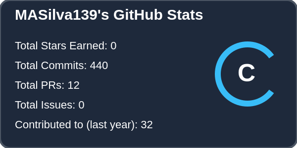
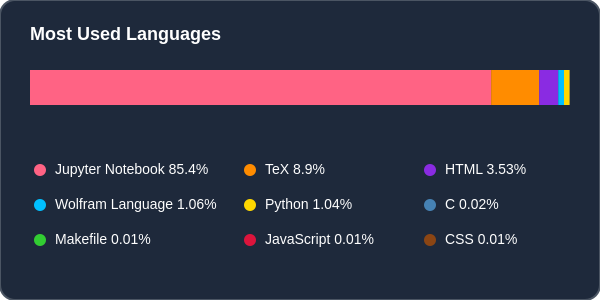
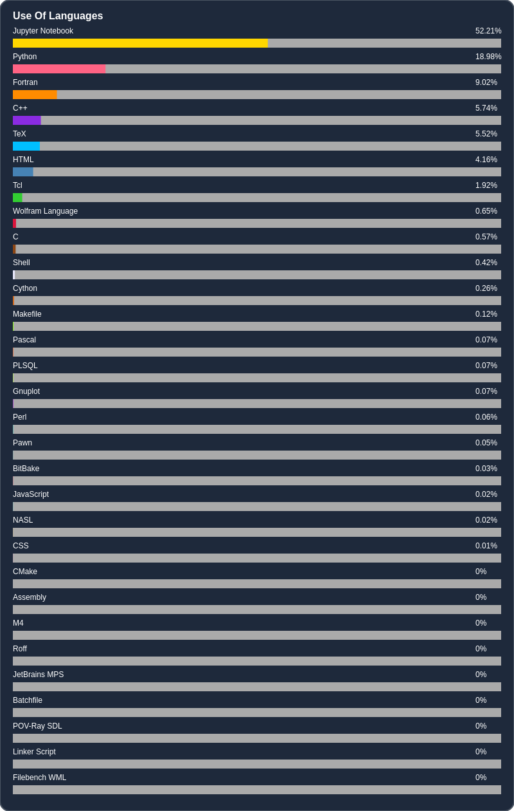
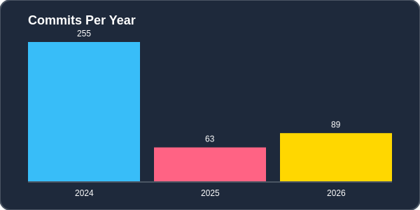
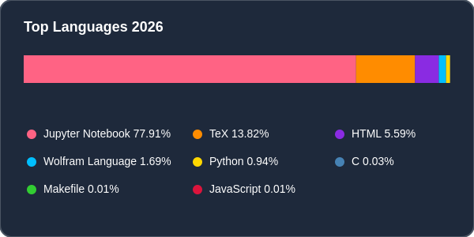
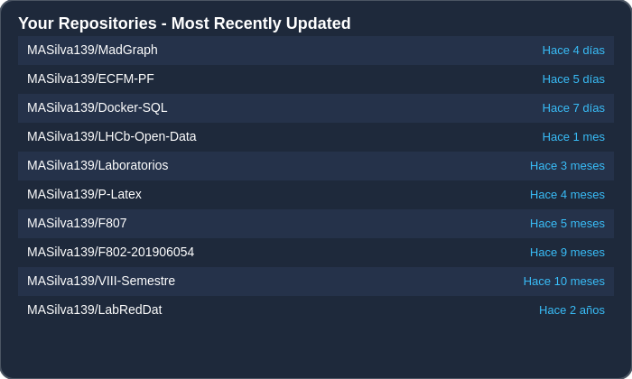

# 💫 Acerca de mi:
Soy MASilva, soy un estudiante de Física Aplicada en la Universidad de San Carlos de Guatemala. Me apaciona resolver problemas complejos y aprender nuevas herramientas en las que pueda aplicar mis conocimientos.   - 📚 Actualmente estoy en proceso de cierre de la carrera de Física Aplicada en la Universidad de San Carlos de Guatemala. - 💡 Tengo interés por aplicar mis conocimientos en lenguajes de programación como Python y ROOT. - 

## 💻 Tech Stack:

<!--               -->

<!-- https://github.com/tandpfun/skill-icons#readme -->

### 🔷 Lenguajes de Programación

  
  
  
  
  
  
  
  
  

### 🖥️ Sistemas & Distribuciones

  
  
  

### 🔧 Herramientas de Desarrollo

  
  
  
  
  

### ⌨️ Editores & IDEs

  

### 🧩 Lenguajes Web

  
  
  

<!-- ## 📊 GitHub Stats: -->
<!-- LANGUAGES-START -->
## 📊 GitHub Stats

<table align="center">
  <tr>
    <td align="center">
      
    </td>
    <td align="center">
      
    </td>
  </tr>
</table>

---------

## 🔢 Lenguajes Usados

<table align="center">
  <tr>
    <td align="center">
      
    </td>
  </tr>
</table>

---------

## 📅 Commits por Año

<table align="center">
  <tr>
    <td align="center">
      
    </td>
    <td align="center">
      
    </td>
  </tr>
</table>

---------

## 🧑‍💻 Repositorios Recientes

<table align="center">
  <tr>
    <td align="center">
      
    </td>
  </tr>
</table>

<!-- LANGUAGES-END -->
------
